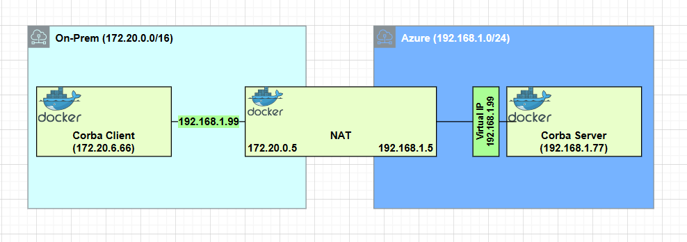

# Architecture



# Commands

```
docker build -f Dockerfile.server -t iiop-and-nat-server-v1 .
docker build -f Dockerfile.client -t iiop-and-nat-client-v1 .
docker build -f Dockerfile.nat -t my-ubuntu-nettools .


docker network create --subnet=172.20.0.0/16 net_onprem
docker network create --subnet=192.168.1.0/24 net_azure


-- 192.168.1.99 -- virtual IP of the server


docker run -d --name corba_nat --cap-add=NET_ADMIN --network net_onprem --ip 172.20.0.5 --network-alias nat my-ubuntu-nettools sleep infinity
docker network connect --ip 192.168.1.5 net_azure corba_nat

docker exec -it corba_nat bash
iptables -t nat -A PREROUTING -i eth0 -d 192.168.1.99 -j DNAT --to-destination 192.168.1.77
iptables -t nat -A POSTROUTING -o eth1 -d 192.168.1.77 -j MASQUERADE
exit


docker run -d --name corba_server --cap-add=NET_ADMIN --network net_azure --ip 192.168.1.77 -e SERVER_PORT=17700 -e IOR_PROXY_HOST=192.168.1.99 iiop-and-nat-server-v1
docker run -d --name corba_client --cap-add=NET_ADMIN --network net_onprem --ip 172.20.6.66 -e SERVER_IP=192.168.1.99 -e SERVER_PORT=17700 -e GATEWAY_IP=172.20.0.5 iiop-and-nat-client-v1

==================================================================
ip route add 192.168.1.99 via 172.20.0.5


==================================================================

ip addr add 192.168.1.99/24 dev eth1

tcpdump -i eth0 -w /app/client_traffic.pcap
tcpdump -i eth1 icmp or dst 192.168.1.99
docker cp corba_client:/app/client_traffic.pcap .

winpty docker exec -it corba_client bash
winpty docker exec -it corba_server bash
winpty docker exec -it corba_nat bash


docker network inspect net_onprem
docker network inspect net_azure
```
